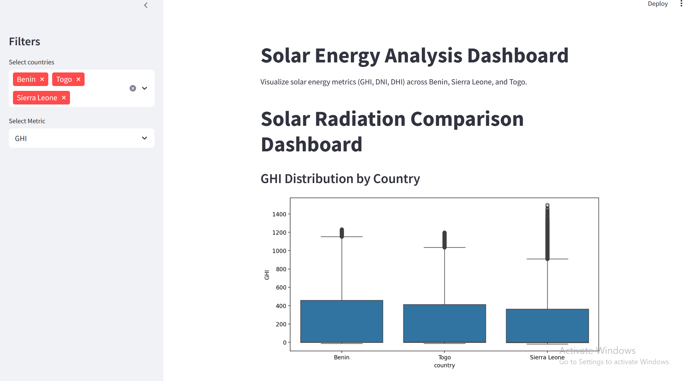

#  MoonLight Solar Strategy Analysis

A Streamlit web application that provides interactive visualizations and insights to support data-driven decision-making for solar energy investments across different regions.

##  Features

-  Upload and analyze solar potential datasets
-  Compare countries based on solar intensity, temperature, and other environmental variables
-  Generate plots, summary statistics
# screenshoot

